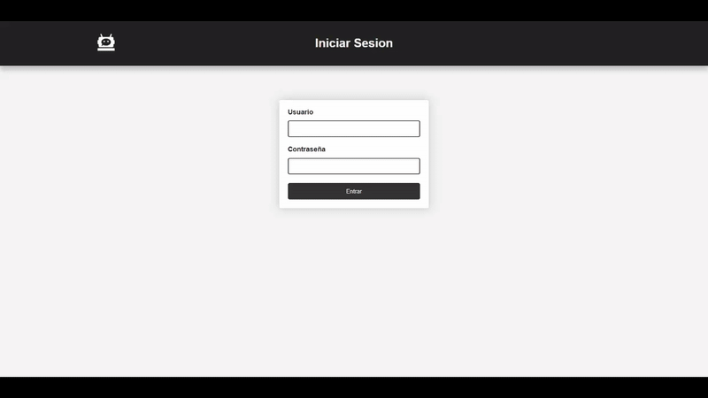
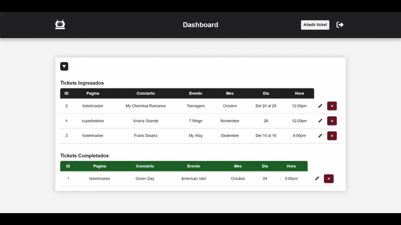

# 🎫 Tickets – Web App

A simple ticket management web application built with Python (Flask). Designed primarily as the frontend/API client for BotTickets, allowing users to create, edit, and delete tickets through a basic web interface.

---

## 🌍 Overview

**Tickets** is a lightweight web project with a minimal UI.
Its main purpose is to provide endpoints and a simple interface to interact with **BotTickets.**

Users can manage tickets directly from the site, but the focus is on backend functionality rather than design.

---

## ✨ Features

- ➕ Add new tickets
- ✏️ Edit existing tickets
- ❌ Delete tickets
- 📄 List and manage all tickets
- 🔗 API integration with BotTickets

---

## 📸 Showcase

### 🔐 Login



### 📊 Dashboard



### 🎟 Add Ticket


### ✏ Edit Ticket


---

## 🛠 Tech Stack

- **Backend:** Flask (Python)
- **Frontend:** HTML5, CSS3, JavaScript
- **Deployment:** Vercel

---

## 📂 Project Structure

```text
Tickets/
│
├── app.py
├── config.py
├── extensions.py
├── requirements.txt
│
├── database/
│   └── ticket.db
│
├── models/
│   └── ticket.py
│
├── routes/
│   ├── api_routes.py
│   ├── auth_routes.py
│   └── web_routes.py
│
├── utils/
│   ├── decorators.py
│   ├── helpers.py
│   └── validators.py
│
├── templates/
│   ├── add_ticket.html
│   ├── base.html
│   ├── dashboard.html
│   ├── edit_ticket.html
│   └── login.html
│
├── static/
│   ├── assets/
│   ├── styles.css
│   └── js/
│       ├── filter.js
│       ├── main.js
│       ├── sections.js
│       └── utils.js
│
└── assets/

```

---

## ⚙️ Installation & Setup

### Clone repo

```bash
git clone https://github.com/fockus26/Tickets.git
cd Tickets
```

### Create virtual environment

```bash
python -m venv venv
source venv/bin/activate   # macOS/Linux
venv\Scripts\activate      # Windows
```

### Install dependencies

```bash
pip install -r requirements.txt
```

### Environment Variables

Create a `.env` file with:

```env
FLASK_KEY=YOUR_FLASK_KEY
API_KEY=YOUR_API_KEY
DB_URL=YOuR_DB_URL
ADMIN_USER=admin1234
ADMIN_PASS=I3S%Hl@%P
```

### Run the app

```bash
python main.py
```

The app will run on:
👉 http://localhost:5000

---

## 📖 Case Study

This project was created as the **frontend/API** companion for **BotTickets.**

While not visually optimized, it fulfills its purpose of managing tickets and exposing endpoints that BotTickets consumes to automate purchases.

---

## 📈 Future Improvements

- 📱 Responsive redesign for mobile

---

## 📜 License

This project is **proprietary software. All rights reserved.**
Unauthorized use, copying, modification, or distribution of this code is strictly prohibited without prior written permission.
